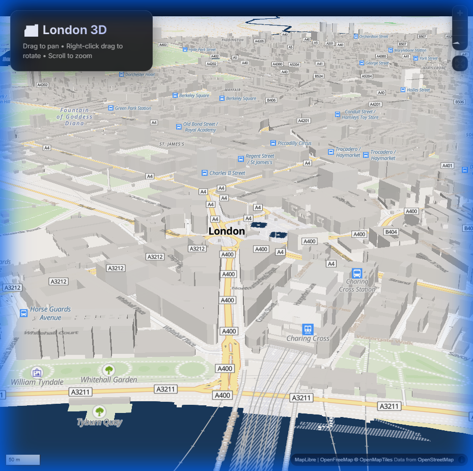

# 🏙️ 3D Map

An interactive 3D visualization of London built with WebGL. Explore the city's architecture with smooth pan, rotate, and zoom controls — plus real-time data layers for property prices, crime stats, and air quality.



## ✨ Features

| Feature | Description | Data Source |
|---------|-------------|-------------|
| ☀️ **Sunlight Analyzer** | Simulate sun position throughout the day | `suncalc` library |
| 🏠 **Property Viewer** | Click anywhere to see recent sold prices | HM Land Registry (SPARQL API) |
| 🚨 **Crime Heatmap** | Toggle crime density visualization | data.police.uk API |
| 🌫️ **Air Quality** | Real-time pollution levels | London Air Quality Network |

All data sources are **free and open** — no API keys required.

---

## 🎯 Project Uniqueness (Technical Overview)

### The Problem I Solved

Traditional map APIs (Google Maps, Mapbox) charge **$7+ per 1,000 map loads**. For a startup or portfolio project with 10,000 monthly users, that's **$70/month just for maps**.

**My solution:** A production-ready 3D map with **zero ongoing costs**.

### Technical Architecture

```
┌─────────────────────────────────────────────────────────────┐
│                      Browser (Client)                        │
├─────────────────────────────────────────────────────────────┤
│  MapLibre GL JS ──► WebGL Renderer ──► GPU Acceleration     │
│         │                                                    │
│         ▼                                                    │
│  Vector Tiles ◄── OpenFreeMap (CDN) ◄── OpenStreetMap Data  │
└─────────────────────────────────────────────────────────────┘
```

### Key Technical Decisions

| Decision | Why It Matters |
|----------|----------------|
| **MapLibre GL JS over Leaflet** | Native WebGL = 60fps rendering vs Canvas-based alternatives |
| **Vector tiles over raster** | 10x smaller payloads, infinite zoom, client-side styling |
| **Fill-extrusion layers** | GPU-accelerated 3D without Three.js complexity |
| **OpenFreeMap** | No API keys, no rate limits, no vendor lock-in |

### Performance Optimizations

1. **Tile streaming** — Only loads visible tiles, discards off-screen data
2. **GPU instancing** — Thousands of buildings rendered in single draw calls
3. **LOD (Level of Detail)** — Buildings only render at zoom ≥14
4. **Lazy layer loading** — 3D layer added after base map is interactive

### What I Learned Building This

- **WebGL coordinate systems** — Translating WGS84 (lat/lon) to Mercator projection
- **Vector tile spec** — MVT format, z/x/y tile addressing, source-layer filtering
- **GPU memory management** — Why geometry merging matters for 5000+ buildings
- **Open data ecosystems** — OSM contribution model, tile server infrastructure

---

## ✨ Cost Comparison

| Feature | This Project | Google Maps API | Mapbox |
|---------|--------------|-----------------|--------|
| **Monthly Cost** | 🆓 **$0** | 💰 $7/1k loads | 💰 $5/1k loads |
| **API Key Required** | ❌ No | ✅ Yes | ✅ Yes |
| **Self-Hostable** | ✅ Yes | ❌ No | ⚠️ Partial |
| **Full Customization** | ✅ Yes | ❌ Limited | ⚠️ Partial |
| **3D Buildings** | ✅ Yes | ✅ Yes | ✅ Yes |

---

## 🚀 Quick Start

```bash
git clone https://github.com/fxxii/london-3d-map.git
cd london-3d-map
npm install
npm run dev
```

Open http://localhost:5173

## 🎮 Controls

| Action | Input |
|--------|-------|
| Pan | Left-click + drag |
| Rotate/Tilt | Right-click + drag |
| Zoom | Scroll wheel |

## 🛠️ Tech Stack

- **[MapLibre GL JS](https://maplibre.org/)** — Open-source WebGL map engine (Mapbox GL fork)
- **[OpenFreeMap](https://openfreemap.org/)** — Free vector tile CDN
- **[Vite](https://vitejs.dev/)** — ES module dev server with HMR

## 📁 Project Structure

```
├── index.html      # Entry point with loading UI
├── main.js         # Map init, 3D extrusion, lighting
├── style.css       # Glassmorphism UI theme
└── package.json
```

## 🎨 Customization Examples

```javascript
// Change building colors (main.js:78)
'fill-extrusion-color': '#your-hex-color'

// Change location (main.js:5)
const LONDON_CENTER = [-0.1279, 51.5076]; // [lng, lat]

// Adjust 3D tilt (main.js:13)
pitch: 60  // 0 = flat, 85 = max tilt
```

---

## 📄 License

MIT — Free for commercial and personal use.

## 🙏 Data Attribution

- Map data © [OpenStreetMap](https://www.openstreetmap.org/) contributors
- Vector tiles by [OpenFreeMap](https://openfreemap.org/)
- Rendering by [MapLibre](https://maplibre.org/)
